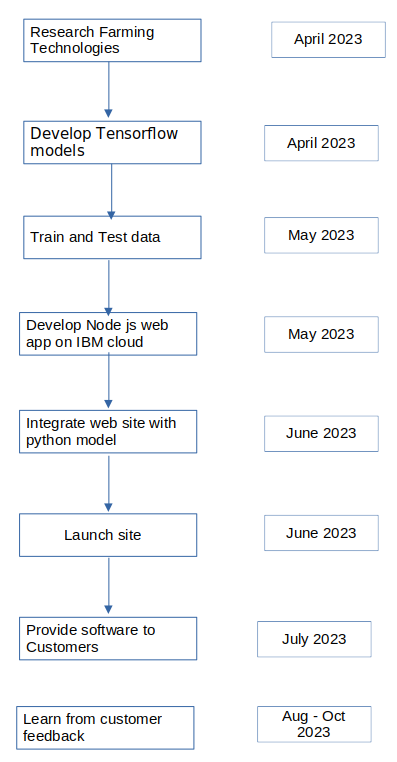

# Farmtech2
IBM 2023 competition
## Project summary

### The issue we are hoping to solve
Farmers have problems in finding location of unhealthy plants or stress zones of plants. By identifying unhelathy plants farmers can act beforehand. Our app helps in predicitng farm yields, finding stressed plants and detecting weeds in farms  

### How our technology solution can help
Our app helps in predicitng farm yields, finding stressed plants and detecting weeds in farms

### Our idea
Farmers have problems in finding location of unhealthy plants or stress zones of plants. By identifying unhelathy plants farmers can act beforehand. 
Also farmers need to predict yeilds of their plants so for future planning of resources like pesticedes, budget, insurances, and so on. Poor planning and unhealthy plants can cause huge losses to farmers. 

We have developed AI app that farmers can upload their drone photo of farm and get vegetation index of farm which shows stressed plants and also predicts yeilds of farm. First we can upload last 3 years of  production data, select crop type and then image of farm. After processing we get vegetation index and by using this vegetation index, we get future prediction of farm yields. Also in this map we can understand which plants are stressed like less water content or has diseases. Red areas highlight such plants.This also helps to avoid using over excessive pesticides at all farm area and instead focus on area where it is required thereby saving costs. Hence Farmers can solve these problems beforehand and get healthy crops.

Also we have developed weed detection system from this maps. farmer can upload image of farm and AI trained model can detect parts affected by weeds. Weeds damages farms very severly and reduce farm production. Our solution helps small farmers and also helps food security in developing nations. In short our app helps in predicitng farm yields, finding stressed plants and detecting weeds in farms  

AI model is trained using tensor flow, Ibm watson studio and IBM cloud engine to host node js website and  database.  

## Technology implementation

### IBM AI service(s) used
AI model is trained using tensor flow, Ibm watson studio and IBM cloud engine to host node js website and  database.

### Solution architecture

### Solution demo video
https://www.youtube.com/watch?v=j7-jP6SlAYQ 

### Project development roadmap

### How to run the project

Install Node js server and install all dependecies of Python libraries 
